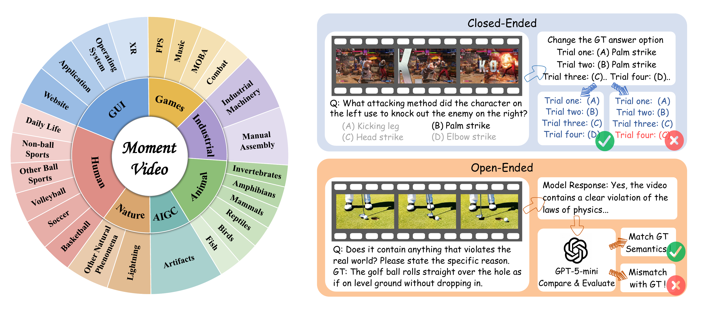
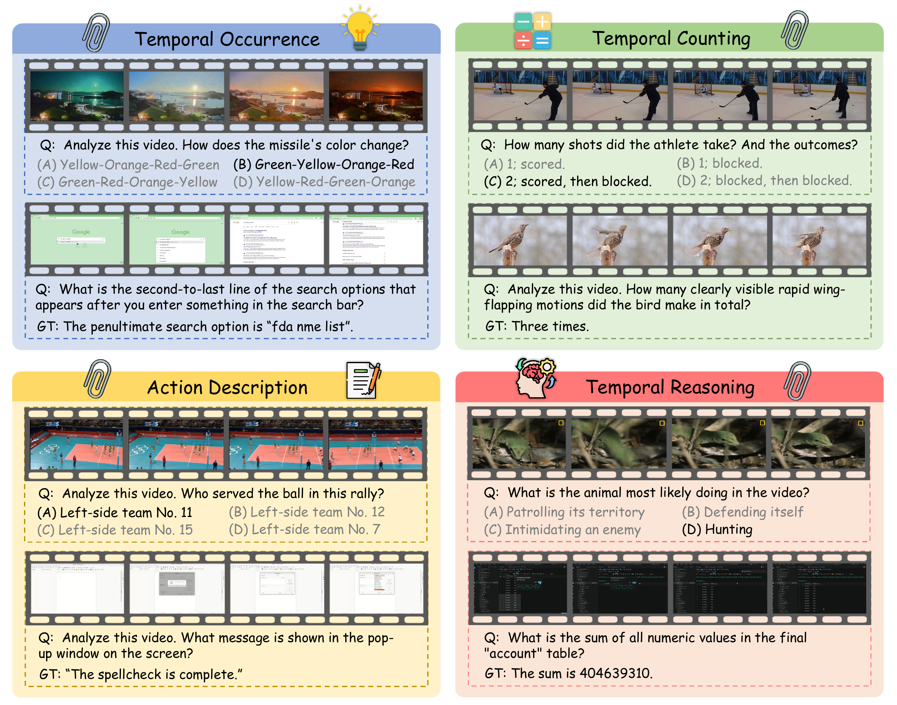
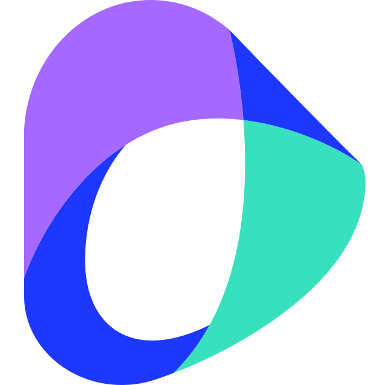
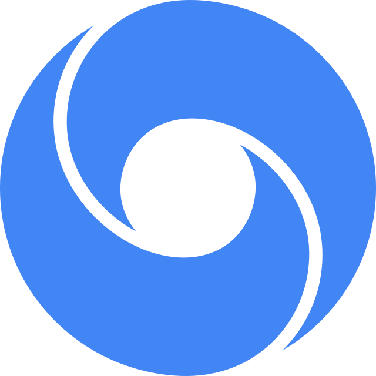

<div align="center">

# Moment-Video: Diagnosing Temporal Fidelity of Video MLLMs on Momentary Visual Events

[Xiaolin Liu](https://orcid.org/0009-0004-5440-5908)\*,
[Yilun Zhu](https://scholar.google.com/citations?user=ptcnWOkAAAAJ&hl=en&authuser=1)\*,
[Xiangyu Zhao](https://scholar.google.com/citations?user=eqFr7IgAAAAJ&hl=zh-TW&oi=ao)\*,
[Xuehui Wang](https://huiserwang.site/),

[Yan Li](https://dblp.org/pid/87/660-98.html),
[Xin Li](https://scholar.google.com/citations?user=-0Vmm04AAAAJ),
[Haoyu Cao](https://scholar.google.com/citations?hl=zh-CN&user=LV8ejn8AAAAJ),
[Xing Sun](https://scholar.google.com/citations?hl=zh-CN&user=IUtix9IAAAAJ),

[Shaofeng Zhang](https://sherrylone.github.io/),
[Xu Yang](https://scholar.google.com/citations?user=SqdxMH0AAAAJ&hl=en),
[Zhihang Zhong](https://zzh-tech.github.io/),
[Xue Yang](https://yangxue.site/)

</div>

<p align="center">
  <a href="https://arxiv.org/abs/XXXX.XXXXX">
    
  </a>
  <a href="https://huggingface.co/datasets/VisionXLab/Moment-Video">
    
  </a>
</p>

<div align="center">
  
</div>

## 🎬 Introduction

**Moment-Video** is a benchmark for diagnosing the temporal fidelity of video multimodal large language models (MLLMs) on **momentary visual events**: localized actions or state transitions that may last only a few frames, yet determine the correct answer.

Unlike benchmarks centered on persistent objects, global scene context, or long-form semantic aggregation, Moment-Video asks whether models can notice, count, describe, and reason over brief answer-critical evidence. The benchmark contains **1,000 human-verified video-QA pairs** across **7 domains** and **25 fine-grained subcategories**, covering both real-world and virtual scenarios.

Moment-Video evaluates four complementary task types:

- **Temporal Occurrence (TO):** whether a brief event or state transition happens.
- **Temporal Counting (TC):** how many transient actions, object changes, or repeated events occur.
- **Action Description (AD):** how a momentary event unfolds, including direction, trajectory, target, interaction, or state change.
- **Temporal Reasoning (TR):** how the pre-event state, momentary event, and post-event state imply the final answer.

<div align="center">
  
</div>

## 📊 Benchmark Performance

We evaluate **33 proprietary and open-source video MLLMs** on Moment-Video. **Seed-2.0-Pro**, **Seed-2.0-Lite**, **Seed-2.0-Mini**, and **MIMO-v2.5** use their default frame-sampling settings. All other models are evaluated with **1 FPS** and a **64-frame cap**, except **GPT-5.4**, which uses a **50-frame cap**.

The best-performing model, **Seed-2.0-Pro**, reaches only **39.6%** overall accuracy, while most open-source models remain below **25%**, revealing a substantial gap in current models' ability to capture and use brief but decisive visual evidence. In each column, the best result is shown in **bold** and the second-best result is <u>underlined</u>.

<div align="center">
<a id="leaderboard"></a>
<h3>🎯 Overall accuracy by task type</h3>

<table>
  <thead>
    <tr>
      <th>Model</th>
      <th>TO (%)</th>
      <th>TC (%)</th>
      <th>AD (%)</th>
      <th>TR (%)</th>
      <th>Overall (%)</th>
    </tr>
  </thead>
  <tbody>
    <tr><td> <b>Seed-2.0-Pro</b> 🏅</td><td><b>50.37</b></td><td><b>31.14</b></td><td><b>47.08</b></td><td><b>42.35</b></td><td><b>39.6</b></td></tr>
    <tr><td> Seed-2.0-Lite 🥈</td><td>34.81</td><td><u>25.64</u></td><td>36.04</td><td><u>40.00</u></td><td><u>31.3</u></td></tr>
    <tr><td> Seed-2.0-Mini 🥉</td><td>32.59</td><td>22.88</td><td>33.77</td><td>25.88</td><td>27.8</td></tr>
    <tr><td> Gemini-3.1-Pro</td><td>32.59</td><td>19.70</td><td>33.44</td><td>34.12</td><td>26.9</td></tr>
    <tr><td> Gemini-3-Flash</td><td><u>41.48</u></td><td>18.43</td><td>31.82</td><td>32.94</td><td>26.9</td></tr>
    <tr><td> Gemini-3.1-Flash-Lite</td><td>34.07</td><td>18.64</td><td>30.52</td><td>27.06</td><td>25.1</td></tr>
    <tr><td> Kimi-2.6</td><td>25.93</td><td>15.89</td><td><u>36.69</u></td><td>30.59</td><td>24.9</td></tr>
    <tr><td> Qwen3.5-27B</td><td>20.74</td><td>19.07</td><td>32.47</td><td>27.06</td><td>24.1</td></tr>
    <tr><td> Qwen3.5-397B-A17B</td><td>27.41</td><td>14.83</td><td>32.79</td><td>23.53</td><td>22.8</td></tr>
    <tr><td> Qwen3.6-27B</td><td>19.26</td><td>17.16</td><td>31.82</td><td>23.53</td><td>22.5</td></tr>
    <tr><td> MIMO-v2.5</td><td>18.52</td><td>17.16</td><td>30.84</td><td>23.53</td><td>22.1</td></tr>
    <tr><td> Qwen3.5-122B-A10B</td><td>25.19</td><td>14.19</td><td>27.60</td><td>23.53</td><td>20.6</td></tr>
    <tr><td> GPT-5.4</td><td>21.48</td><td>12.08</td><td>30.19</td><td>29.41</td><td>20.4</td></tr>
    <tr><td> Qwen3.6-35B-A3B</td><td>17.04</td><td>14.41</td><td>29.22</td><td>24.71</td><td>20.2</td></tr>
    <tr><td> Qwen3.5-35B-A3B</td><td>20.00</td><td>16.10</td><td>26.30</td><td>18.82</td><td>20.0</td></tr>
    <tr><td> Gemma-4-31B</td><td>30.37</td><td>13.56</td><td>24.35</td><td>22.35</td><td>19.9</td></tr>
    <tr><td> Qwen3.5-9B</td><td>18.52</td><td>13.35</td><td>26.62</td><td>18.82</td><td>18.6</td></tr>
    <tr><td> Qwen3.5-4B</td><td>19.26</td><td>13.77</td><td>21.43</td><td>17.65</td><td>17.2</td></tr>
    <tr><td> Qwen3-VL-235B-A22B</td><td>15.56</td><td>12.08</td><td>23.38</td><td>23.53</td><td>17.0</td></tr>
    <tr><td> InternVL3.5-30B-A3B</td><td>12.59</td><td>16.10</td><td>21.75</td><td>11.76</td><td>17.0</td></tr>
    <tr><td> Qwen3-VL-30B-A3B</td><td>18.52</td><td>13.14</td><td>20.45</td><td>20.00</td><td>16.7</td></tr>
    <tr><td> InternVL3.5-8B</td><td>15.56</td><td>15.04</td><td>20.13</td><td>15.29</td><td>16.7</td></tr>
    <tr><td> LLaVA-Video-72B</td><td>13.33</td><td>15.04</td><td>18.83</td><td>17.65</td><td>16.2</td></tr>
    <tr><td> InternVL3.5-241B-A28B</td><td>19.26</td><td>11.02</td><td>20.45</td><td>18.82</td><td>15.7</td></tr>
    <tr><td> Keye-VL-1.5-8B</td><td>14.81</td><td>12.92</td><td>20.45</td><td>14.12</td><td>15.6</td></tr>
    <tr><td> InternVL3.5-4B</td><td>14.81</td><td>13.14</td><td>17.86</td><td>7.06</td><td>14.3</td></tr>
    <tr><td> GLM-4.6V</td><td>15.56</td><td>8.69</td><td>19.81</td><td>21.18</td><td>14.1</td></tr>
    <tr><td> Qwen3-VL-8B</td><td>15.56</td><td>10.59</td><td>17.86</td><td>16.47</td><td>14.0</td></tr>
    <tr><td> Qwen3-VL-4B</td><td>14.81</td><td>8.69</td><td>19.48</td><td>21.18</td><td>13.9</td></tr>
    <tr><td> LLaVA-Video-7B</td><td>11.11</td><td>13.14</td><td>13.96</td><td>7.06</td><td>12.6</td></tr>
    <tr><td> VideoLLaMA3-7B</td><td>7.52</td><td>13.69</td><td>11.72</td><td>8.33</td><td>11.8</td></tr>
    <tr><td> GLM-4.6V-Flash</td><td>11.11</td><td>7.20</td><td>14.29</td><td>20.00</td><td>11.0</td></tr>
    <tr><td> VITA-1.5</td><td>19.26</td><td>8.49</td><td>13.42</td><td>10.59</td><td>10.6</td></tr>
  </tbody>
</table>

</div>

<div align="center">
<h3>🌐 Overall accuracy by video domain</h3>

<table>
  <thead>
    <tr>
      <th>Model</th>
      <th>AIGC (%)</th>
      <th>GUI (%)</th>
      <th>Nature (%)</th>
      <th>Industry (%)</th>
      <th>Games (%)</th>
      <th>Human (%)</th>
      <th>Animal (%)</th>
      <th>Overall (%)</th>
    </tr>
  </thead>
  <tbody>
    <tr><td> <b>Seed-2.0-Pro</b> 🏅</td><td><b>45.57</b></td><td><u>33.94</u></td><td><b>69.44</b></td><td><b>41.32</b></td><td><b>39.37</b></td><td><b>27.20</b></td><td><u>55.00</u></td><td><b>39.6</b></td></tr>
    <tr><td> Seed-2.0-Lite 🥈</td><td>22.78</td><td>27.98</td><td>51.39</td><td><u>30.58</u></td><td><u>25.62</u></td><td><u>26.80</u></td><td>52.00</td><td><u>31.3</u></td></tr>
    <tr><td> Seed-2.0-Mini 🥉</td><td>24.05</td><td>22.94</td><td><u>58.33</u></td><td>29.75</td><td>22.50</td><td>20.80</td><td>43.00</td><td>27.8</td></tr>
    <tr><td> Gemini-3.1-Pro</td><td><u>27.85</u></td><td>27.52</td><td>44.44</td><td>18.18</td><td>24.37</td><td>19.20</td><td>46.00</td><td>26.9</td></tr>
    <tr><td> Gemini-3-Flash</td><td><b>45.57</b></td><td>20.64</td><td>43.06</td><td>15.70</td><td>20.62</td><td>23.20</td><td>47.00</td><td>26.9</td></tr>
    <tr><td> Gemini-3.1-Flash-Lite</td><td><u>27.85</u></td><td>22.02</td><td>41.67</td><td>22.31</td><td>20.00</td><td>14.00</td><td><b>57.00</b></td><td>25.1</td></tr>
    <tr><td> Kimi-2.6</td><td>15.19</td><td><b>37.16</b></td><td>41.67</td><td>12.40</td><td>16.25</td><td>20.40</td><td>34.00</td><td>24.9</td></tr>
    <tr><td> Qwen3.5-27B</td><td>11.39</td><td>21.56</td><td>41.67</td><td>18.18</td><td>18.75</td><td>20.00</td><td><b>53.00</b></td><td>24.1</td></tr>
    <tr><td> Qwen3.5-397B-A17B</td><td>16.46</td><td>23.39</td><td>47.22</td><td>18.18</td><td>17.50</td><td>14.80</td><td>43.00</td><td>22.8</td></tr>
    <tr><td> Qwen3.6-27B</td><td>10.13</td><td>26.61</td><td>41.67</td><td>19.01</td><td>16.25</td><td>14.40</td><td>44.00</td><td>22.5</td></tr>
    <tr><td> MIMO-v2.5</td><td>2.53</td><td>24.31</td><td>52.78</td><td>19.01</td><td>19.38</td><td>14.80</td><td>37.00</td><td>22.1</td></tr>
    <tr><td> Qwen3.5-122B-A10B</td><td>18.99</td><td>22.02</td><td>40.28</td><td>17.36</td><td>13.75</td><td>14.40</td><td>35.00</td><td>20.6</td></tr>
    <tr><td> GPT-5.4</td><td>6.33</td><td>23.85</td><td>40.28</td><td>4.96</td><td>18.75</td><td>18.00</td><td>37.00</td><td>20.4</td></tr>
    <tr><td> Qwen3.6-35B-A3B</td><td>3.80</td><td>18.35</td><td>41.67</td><td><b>22.31</b></td><td>15.62</td><td>15.20</td><td>39.00</td><td>20.2</td></tr>
    <tr><td> Qwen3.5-35B-A3B</td><td>8.86</td><td>19.27</td><td>45.83</td><td>19.83</td><td>13.75</td><td>12.80</td><td>40.00</td><td>20.0</td></tr>
    <tr><td> Gemma-4-31B</td><td><u>27.85</u></td><td>11.93</td><td>41.67</td><td>17.36</td><td>15.62</td><td>15.60</td><td>36.00</td><td>19.9</td></tr>
    <tr><td> Qwen3.5-9B</td><td>10.13</td><td>17.43</td><td>40.28</td><td>12.40</td><td>11.87</td><td>14.80</td><td>40.00</td><td>18.6</td></tr>
    <tr><td> Qwen3.5-4B</td><td>8.86</td><td>16.97</td><td>38.89</td><td>13.22</td><td>15.00</td><td>11.20</td><td>32.00</td><td>17.2</td></tr>
    <tr><td> Qwen3-VL-235B-A22B</td><td>5.06</td><td>16.97</td><td>38.89</td><td>10.74</td><td>10.62</td><td>14.00</td><td>36.00</td><td>17.0</td></tr>
    <tr><td> InternVL3.5-30B-A3B</td><td>3.80</td><td>10.55</td><td>38.89</td><td>15.70</td><td>15.00</td><td>18.40</td><td>27.00</td><td>17.0</td></tr>
    <tr><td> Qwen3-VL-30B-A3B</td><td>8.86</td><td>14.22</td><td>43.06</td><td>14.05</td><td>15.62</td><td>9.60</td><td>32.00</td><td>16.7</td></tr>
    <tr><td> InternVL3.5-8B</td><td>3.80</td><td>11.93</td><td>38.89</td><td>13.22</td><td>13.75</td><td>14.00</td><td>37.00</td><td>16.7</td></tr>
    <tr><td> LLaVA-Video-72B</td><td>0.00</td><td>8.26</td><td>34.72</td><td>19.83</td><td>16.25</td><td>15.20</td><td>31.00</td><td>16.2</td></tr>
    <tr><td> InternVL3.5-241B-A28B</td><td>1.27</td><td>12.39</td><td>40.28</td><td>9.09</td><td>11.87</td><td>13.60</td><td>36.00</td><td>15.7</td></tr>
    <tr><td> Keye-VL-1.5-8B</td><td>0.00</td><td>10.09</td><td>29.17</td><td>17.36</td><td>14.37</td><td>14.40</td><td>33.00</td><td>15.6</td></tr>
    <tr><td> InternVL3.5-4B</td><td>3.80</td><td>10.55</td><td>29.17</td><td>14.05</td><td>13.75</td><td>10.80</td><td>30.00</td><td>14.3</td></tr>
    <tr><td> GLM-4.6V</td><td>5.06</td><td>10.55</td><td>31.94</td><td>7.44</td><td>11.25</td><td>12.40</td><td>33.00</td><td>14.1</td></tr>
    <tr><td> Qwen3-VL-8B</td><td>8.86</td><td>13.30</td><td>41.67</td><td>9.92</td><td>6.88</td><td>8.80</td><td>29.00</td><td>14.0</td></tr>
    <tr><td> Qwen3-VL-4B</td><td>1.27</td><td>14.22</td><td>41.67</td><td>7.44</td><td>9.38</td><td>9.20</td><td>30.00</td><td>13.9</td></tr>
    <tr><td> LLaVA-Video-7B</td><td>0.00</td><td>8.72</td><td>23.61</td><td>8.26</td><td>15.62</td><td>12.80</td><td>23.00</td><td>12.6</td></tr>
    <tr><td> VideoLLaMA3-7B</td><td>0.00</td><td>10.44</td><td>25.35</td><td>4.96</td><td>10.14</td><td>15.64</td><td>15.00</td><td>11.8</td></tr>
    <tr><td> GLM-4.6V-Flash</td><td>1.27</td><td>8.72</td><td>43.06</td><td>13.22</td><td>10.00</td><td>6.00</td><td>12.00</td><td>11.0</td></tr>
    <tr><td> VITA-1.5</td><td>0.00</td><td>5.31</td><td>25.00</td><td>8.26</td><td>11.25</td><td>8.80</td><td>26.00</td><td>10.6</td></tr>
  </tbody>
</table>

</div>

## 🚀 Quick Start

### 📁 1. Data Preparation

The benchmark annotations are provided in [`data/annotation_all.csv`](data/annotation_all.csv) and [`data/annotation_all.json`](data/annotation_all.json). Place videos under the following structure:

```text
data/videos/{Category}/{Subclass}/{Index}.mp4
```

For example, a sample with `Category=Human`, `Subclass=Basketball`, and `Index=0001` should be stored as:

```text
data/videos/human/basketball/1.mp4
```

### 🎞️ 2. Native Video Inference

Use this path for OpenAI-compatible endpoints that accept native `video_url` input.

```bash
python scripts/inference_native_video.py \
  --input-csv data/annotation_all.csv \
  --video-root data/videos \
  --output-dir result/output \
  --model Qwen3-VL-4B-Instruct \
  --base-url http://127.0.0.1:8085/v1
```

### 🖼️ 3. Sampled-Frame Inference

Use this path when a model consumes sampled frames as multiple image inputs.

```bash
python scripts/inference_sampled_frames.py \
  --input-csv data/annotation_all.csv \
  --video-root data/videos \
  --output-dir result/output_frames \
  --model Kimi-2.6 \
  --base-url http://127.0.0.1:8085/v1 \
  --sample-fps 1 \
  --max-sampled-frames 64
```

### ⚖️ 4. LMM-as-a-Judge Evaluation

We provide an example evaluator that calls an LLM judge via an OpenAI-compatible API to assess model answers. Closed multiple-choice samples use the stored closed-question pass flag when available; open-ended samples are judged semantically against the reference answer.

```bash
python scripts/eval_llm_judge_openrouter.py \
  --input-csv result/output/result_video_{MODEL_NAME}_{TIMESTAMP}.csv \
  --output-dir result/judge \
  --workers 8
```

Set the appropriate API key (e.g., `OPENROUTER_API_KEY`) before running. The evaluator reports overall accuracy and grouped accuracy by answer type, video domain, subcategory, and task type.

## 📚 Citation

Citation will be added after the arXiv version is available.

```bibtex
Coming soon.
```
